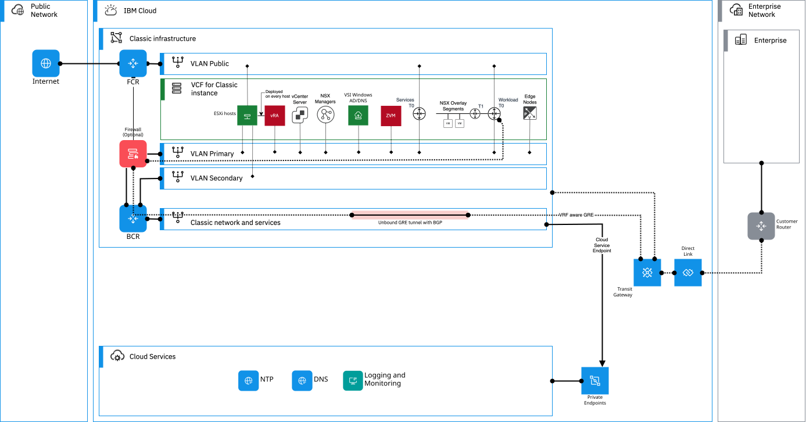
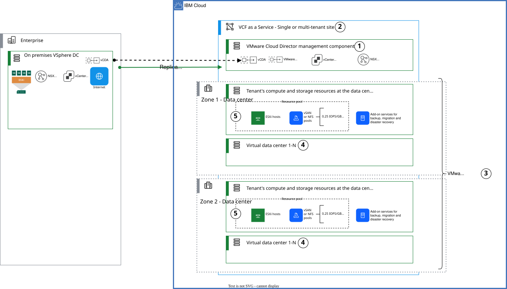
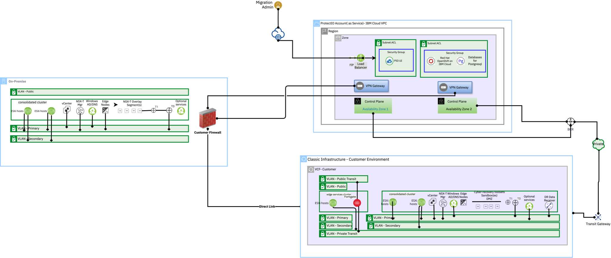
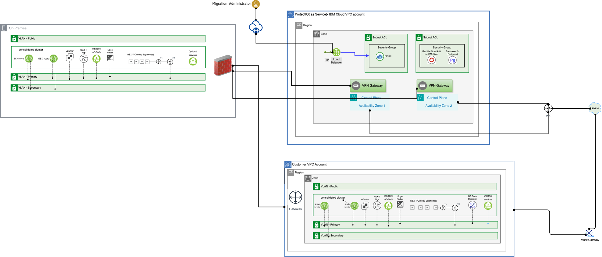

---
copyright:
  years: 2025
lastupdated: "2025-04-30"

keywords:

subcollection: hcx-migration-vmware

---

{{site.data.keyword.attribute-definition-list}}

# Migrate VMware workloads to {{site.data.keyword.Bluemix_notm}} VMware environment
{: #migration-overview}

The VMware workload migration options for {{site.data.keyword.Bluemix_notm}} white paper introduces and provides options for customers who are considering migrating VMware workloads to an {{site.data.keyword.Bluemix_notm}} VMware environment.

As enterprises accelerate their cloud adoption journeys, moving VMware workloads to the cloud has become a top priority for IT leaders. {{site.data.keyword.Bluemix_notm}} provides a robust VMware environment that allows organizations to migrate workloads with minimal disruption, using industry-leading tools and methodologies.
{: shortdesc}

For CTOs and CIOs evaluating cloud migration, it is crucial to choose the right migration approach to align with business goals, operational efficiency and risk mitigation. An overview of the top five migration strategies for moving VMware workloads to {{site.data.keyword.Bluemix_notm}} are covered in this white paper:

1. VMware Hybrid Cloud Extension (HCX)
2. Veeam
3. Zerto
4. VMware Cloud Director Availability (VCDA)
5. PrimaryIO

Each of the following migration methods offers unique advantages, addressing different use cases such as workload mobility, disaster recovery, data replication and cost efficiency.

## VMware Hybrid Cloud Extension (HCX) migration option
{: #overview-hcx}

VMware Hybrid Cloud Extension (HCX) is a purpose-built solution designed to simplify workload migration and interconnectivity between on-premises data centers and {{site.data.keyword.Bluemix_notm}}. It enables live migrations without downtime, making it ideal for businesses that require continuous availability. Key benefits include:

* Seamless large-scale migration of workloads without reconfiguration.
* Support of vMotion for real-time migration and bulk migration for large workloads.
* WAN optimization that improves data transfer efficiency.
* Disaster recovery capabilities to minimize risks.
* Ideal for companies requiring long-term hybrid cloud strategies.

VMware HCX on {{site.data.keyword.Bluemix_notm}} is a robust solution for seamless workload migration and application mobility between on-premises VMware environments and {{site.data.keyword.Bluemix_notm}}. It enables enterprises to modernize infrastructure with minimal downtime by automating large-scale live migrations and optimizing network performance. HCX provides secure, encrypted connectivity, simplifying hybrid cloud adoption without requiring application refactoring. Integrated with {{site.data.keyword.Bluemix_notm}} for VMware Solutions, it can ensure high availability, scalability and operational consistency. Businesses benefit from reduced migration complexity, lower costs and enhanced disaster recovery capabilities, making it ideal for enterprises transitioning to a hybrid or multicloud architecture.

For more information, see [VMware HCX](https://www.vmware.com/products/cloud-infrastructure/hcx){: external} and [VCF CORE TECH](https://vcfcore.tech){: external}, a blog with extensive HCX information.

### Understanding {{site.data.keyword.Bluemix_notm}} VMware Solutions
{: #hcx-ibmcloud-overview}

{{site.data.keyword.Bluemix_notm}} VMware Solutions is a cloud-based offering that allows organizations to extend or migrate their existing VMware-based virtualized data centers to the {{site.data.keyword.Bluemix_notm}}. The solution offers different deployment options, including self-managed and managed models, and can be used for both virtualized and cloud native applications. Key features and benefits include the following:

* Extending existing datacenters: The solution facilitates extending on-premises VMware environments to the cloud, allowing for flexible capacity management and resource allocation.
* Migration to the cloud: It supports the migration of existing VMware workloads to the cloud, enabling businesses to modernize their infrastructure and use cloud services.
* Disaster recovery and business continuity: {{site.data.keyword.Bluemix_notm}} for VMware Solutions can serve as a cost-effective disaster recovery site or provide off-site backup options, enhancing business resilience.
* Cloud native applications: The solution can host cloud native applications alongside traditional VMware workloads, providing a unified platform for different application types.
* Flexibility and scalability: The solution offers flexibility in deployment options and allows for scaling resources up or down as needed, based on workload demands.
* Security and compliance: The solution provides a secure and compliant platform for running VMware workloads, with options for enhanced security features.
* Deployment models:
  * Self-managed: Provides single-tenant, bare-metal infrastructure with full control over the hypervisor and vCenter server, ideal for organizations needing high levels of isolation and control.
  * Managed: Uses VMware Cloud Director for a managed, cost-effective solution, ideal for cost-conscious organizations or those needing quick migration of VMs to the cloud.
* Management and control: With the self-managed model, customers have access to the native VMware stack to manage resources and workloads, similar to their on-premises environments. In the managed model, IBm manages up to and including the hypervizor so that customers can focus on the workloads

{{site.data.keyword.Bluemix_notm}} for VMware Solutions provides a comprehensive platform for extending and migrating VMware workloads to the cloud, offering a flexible and secure environment for running various types of applications.

For more information, see [HCX overview on {{site.data.keyword.Bluemix_notm}}](/docs/vmwaresolutions?topic=vmwaresolutions-hcx_considerations).

### Key features and benefits of VMware HCX
{: #hcx-ibmcloud-benefits}

Review the key features and benefits of VMware HCX:

* Seamless and live workload migration.
* VMware HCX on {{site.data.keyword.Bluemix_notm}} supports multiple migration types in line to your business requirement.
* Allows organizations to move workloads to the cloud without major reconfiguration or performance impact.
* Hybrid cloud mobility provides an automated and secure extension of VMware environments between on-premises data centers and {{site.data.keyword.Bluemix_notm}}. It creates high-performance, encrypted network tunnels between environments, enabling workload mobility without network reconfiguration.
* Network extension, HCX’s layer 2 network extension allows businesses to extend on-premises VLANs to {{site.data.keyword.Bluemix_notm}} without changing IP addresses.
* WAN optimization improves performance, reducing latency and bandwidth consumption during migration.
* With simplified operations and automation, HCX simplifies workload migration with an intuitive interface, reducing manual efforts and operational complexity. It automates VM movement, can ensure faster cloud adoption without impacting productivity.

#### Deploying on {{site.data.keyword.Bluemix_notm}}
{: #hcx-ibmcloud-overview-deployment}

While {{site.data.keyword.Bluemix_notm}} has various VMware offering, only the following offer suitable deployment models for VMware HCX:

* VMware Cloud Foundation for Classic - Automated: A single-tenant, self-managed, automated build model offering higher levels of isolation for enhanced security and compliance readiness. The offering is an integrated VMware software-defined data center (SDDC) stack, including vSphere, NSX-T and optionally vSAN. This model is ideal for organizations requiring dedicated resources and greater control over their environment. VMware HCX can be automatically deployed onto this platform.

* VMware Cloud Foundation for Classic - Flexible: A single-tenant, self-managed, manual build model offers clients with in-depth skills to build their own environment on top of vSphere according to their architecture needs. VMware HCX can be manually deployed onto this platform.

* {{site.data.keyword.Bluemix_notm}} for VMware Cloud Foundation (VCF) on VPC: A single-tenant, self-managed, automated build model deployed on {{site.data.keyword.Bluemix_notm}}'s Virtual Private Cloud (VPC) infrastructure. It provides a fully integrated VMware VCF stack, including vSphere, vSAN, NSX-T and SDDC Manager. HCX can be manually installed. This deployment can support both VCF consolidated and VCF standard architecture models, allowing flexibility based on organizational needs.

For more information on deploying, review the following links:

* [Architecture](/docs/vmwaresolutions?topic=vmwaresolutions-hcx-archi-overview)
* [Ordering HCX](/docs/vmwaresolutions?topic=vmwaresolutions-hcx_ordering)
* [HCX Architecture-VCF on VPC](/docs/vmwaresolutions?topic=vmwaresolutions-arch-pattern-vcf-hcx-con)
* [HCX site peering and service mesh in {{site.data.keyword.Bluemix_notm}}](/docs/vmwaresolutions?topic=vmwaresolutions-arch-pattern-vcf-hcx-xconnectivity)

#### Migration methods with VMware HCX
{: #hcx-prereq-migrationmethods}

VMware HCX provides multiple migration techniques to accommodate different workload requirements, availability needs and operational constraints:

* HCX vMotion: Enables live migration with zero downtime, best suited for critical workloads requiring continuous availability.  
* Replication Assisted vMotion (RAV): Uses replication technology to achieve near-zero downtime, making it ideal for enterprise applications.  
* Bulk migration: Designed for large-scale workload moves where scheduled downtime is acceptable.  
* Cold migration: Requires complete VM downtime, primarily used for nonproduction workloads or maintenance scenarios.  
* OS Assisted migration: Allows the migration of non-vSphere workloads, extending HCX’s capabilities beyond traditional VMware environments.  

#### Network extension and IP management  
{: #hcx-prereq-network-extension}

Extending your network to {{site.data.keyword.Bluemix_notm}} during migration is critical to avoid reconfiguration of applications and minimize disruption:

* Network extension service: Preserves existing IP and MAC addresses, can ensure seamless migration without requiring network changes.  
* Re-IP workflows: Applied when IP conflicts arise, requiring address reassignment.  

For most use cases, the network extension service is used as it simplifies migration and reduces reconfiguration efforts.  

### HCX Conclusion
{: #hcx-conclusion}

Migrating VMware workloads to {{site.data.keyword.Bluemix_notm}} by using HCX provides a robust and flexible solution for enterprises seeking to migrate workloads from on-premises to {{site.data.keyword.Bluemix_notm}} for rehosting application workloads with cloud agility. With HCX, you can migrate workloads from vSphere and non-vSphere (KVM and Hyper-V) environments to {{site.data.keyword.Bluemix_notm}} with zero downtime and enable moving applications to the latest VCF software and hardware environment.

### References for VMware HCX
{: #hcx-reference}

* [VMware HCX on {{site.data.keyword.Bluemix_notm}}](/docs/vmwaresolutions?topic=vmwaresolutions-hcx_considerations)
* [VMware Solutions on {{site.data.keyword.Bluemix_notm}}](/docs/vmwaresolutions)
* [Official HCX documentation from Broadcom](https://techdocs.broadcom.com/us/en/vmware-cis/hcx.html){: external}

## Veeam - Backup and replication for data protection migration option
{: #overview-veeam}

Veeam is an industry leader in backup, replication and disaster recovery. Organizations by using Veeam can backup on-premises VMware environments and restore them directly into {{site.data.keyword.Bluemix_notm}}. Key benefits include:

* Can ensure data protection and business continuity with secure backups.
* Supports incremental replication, reducing migration downtime.
* Ransomware protection through immutable storage and encrypted backups.
* Works well for enterprises that require a back up-first approach before migration.

### Understanding Veeam on {{site.data.keyword.Bluemix_notm}}
{: #veeam-overview}

Migrating VMware workloads to the {{site.data.keyword.Bluemix_notm}} is a strategic move that enhances scalability, resilience and cost efficiency. However, helping ensure a secure, fast, and disruption-free migration requires the right tools. Veeam on {{site.data.keyword.Bluemix_notm}} provides a robust, enterprise-grade solution that simplifies VMware workload migration while can ensure business continuity, minimal downtime and strong data protection.

With Veeam’s advanced replication and continuous data protection technologies, organizations can move mission-critical applications such as Oracle and SAP HANA with zero impact on performance. Whether transferring entire virtual machines (VMs), critical application data, or hybrid workloads, Veeam can ensure high availability and reliability across on-premises, hybrid and public cloud environments.

### Key benefits of Veeam
{: #veeam-overview-benefits}

Using Veeam to migrate workloads to {{site.data.keyword.Bluemix_notm}} VMware Solutions has the following benefits:

1. Effortless migration and seamless integration: Easily deployable from the {{site.data.keyword.Bluemix_notm}} catalog, can ensure a smooth migration process without complex configurations.
2. Fast, reliable replication and near-zero data loss with Continuous Data Protection (CDP): Veeam backup and replication offers two powerful built-in migration capabilities for VMware VMs, ensuring fast, reliable replication with minimal downtime. The first approach uses Veeam backup proxy, using traditional backup and restore methods for secure data transfer. The second, Continuous Data Protection (CDP), provides real-time replication, delivering near-zero data loss and achieving low recovery point objectives (RPOs). Designed for mission-critical workloads, CDP enables instant failover, ensuring high availability and rapid recovery if a failure occurs. For more information, [Continuous Data Protection (CDP)](https://helpcenter.veeam.com/docs/backup/vsphere/cdp_replication.html?ver=120){: external}.
3. Enterprise-grade security and compliance: Protects sensitive workloads with end-to-end encryption, ensuring compliance with regulations like GDPR while safeguarding Personally Identifiable Information (PII) and Sensitive Personal Information (SPI).
4. Cost-effective storage optimization: Seamlessly moves migrated workloads and backup files to {{site.data.keyword.Bluemix_notm}} Object Storage, reducing storage costs while maintaining easy accessibility and high performance.

By using Veeam on {{site.data.keyword.Bluemix_notm}}, enterprises can streamline VMware workload migration, minimize risks, and accelerate their cloud transformation journey. With automated failover, robust security and cost-optimized storage, Veeam can ensure a smooth, secure and highly efficient migration experience. Migrate smarter, reduce complexity, and future-proof your VMware workloads with Veeam on {{site.data.keyword.Bluemix_notm}}.

The following table depicts the key differences between the features of Veeam backup proxy and Veeam VMware CDP proxy:

| Feature                        | Veeam backup proxy                | Veeam VMware CDP proxy                |
| ------------------------------ | --------------------------------- | ------------------------------------- |
| Function                       | Backup and restore of VMs         | Real-time replication of VMs          |
| Technology                     | Snapshot-based backups            | VMware APIs for I/O filtering (VAIO)  |
| RPO (Recovery Point Objective) | Hours and Minutes, based on schedule | Near-zero real-time replication     |
| RTO (Recovery Time Objective)  | Minutes to Hours                  | Near-instant failover                 |
| Transport modes                | SAN, HotAdd, NBD                  | Uses VAIO without snapshots           |
| VMware dependency              | Works with VMware and Hyper-V       | Only VMware (vSphere 6.5+)            |
| Best fit for                   | Standard backups, restores, DR    | Mission-critical apps needing low RPO |
{: caption="Veeam Backup Proxy and CDP Proxy comparison" caption-side="bottom"}

### Deployment of Veeam on premises
{: #veeam-on-premises-deployment}

Typically in a migration scenario, the Veeam Backup & Replication (VBR) server is already deployed within the client's on-premises infrastructure. This setup allows for centralized management of backup and replication tasks. The VBR server coordinates with Veeam proxies and repositories to handle data processing and storage. Proxies are responsible for data movement, optimizing the transfer between source and target, while repositories serve as storage locations for the backup data. This configuration ensures efficient data protection and recovery processes.

If the VBR server is not currently deployed, then the VBR server can be deployed in {{site.data.keyword.Bluemix_notm}}, with the required Veeam components deployed on-premises.

### Deployment of Veeam in {{site.data.keyword.Bluemix_notm}} classic environment
{: #veeam-ibmcloudclassic}

#### Architecture of Veeam on {{site.data.keyword.Bluemix_notm}} VMware Solutions (VCF for classic)
{: #veeam-ibmcloudclassic-vcfveeamclassis}

On the {{site.data.keyword.Bluemix_notm}} classic VCF, Veeam components are deployed to facilitate seamless integration with the client's on-premises VBR server. This includes setting up Veeam proxies within the {{site.data.keyword.Bluemix_notm}} environment to handle incoming replication traffic and manage data efficiently. These proxies communicate with the on-premises VBR server, enabling secure and optimized data transfer. Also, backup repositories can be configured within {{site.data.keyword.Bluemix_notm}} to store replicated data, providing a scalable and secure solution for disaster recovery and data archiving.

The following image is the disaster recovery pattern architecture for VMware workloads on {{site.data.keyword.Bluemix_notm}} VCF on classic.

{: caption="Veeam migration for VMware Workloads on {{site.data.keyword.Bluemix_notm}} Classic (VCF) architecture" caption-side="bottom"}

Veeam on {{site.data.keyword.Bluemix_notm}} VMware Solutions (VCF for classic) has the following key features:

1. {{site.data.keyword.Bluemix_notm}} infrastructure:
    1. VMware Cloud Foundation
    2. Multiple ESXi bare metal servers forming a cluster hosting virtual machines
2. Veeam backup and replication server
    1. Responsible for managing the replication jobs
    2. Deployed onto a Microsoft Windows operating system
    3. Deployed within the VMware recovery environment as a virtual machine
    4. Veeam is deployed by using the [simple deployment](https://helpcenter.veeam.com/docs/backup/vsphere/simple.html?ver=120){: external} scenario that's also known as all-in-one.
3. Veeam repository:
    1. The backup repository is responsible for storing replication metadata of the Veeam VMware replication proxies.
    2. The backup repository stores replica metadata that contains information on the read data blocks. For more information, see [Backup repository](https://helpcenter.veeam.com/docs/backup/vsphere/replication_components.html?ver=120#backup-repository){: external}.
    3. Only the backup repository at the protected site is required.
    4. In this pattern, the backup repository is installed on a Linux virtual machine.
    5. Backup repositories can be hosted on Microsoft Windows or Linux operating systems.
    6. The repository has a single network interface, one on an {{site.data.keyword.Bluemix_notm}} portable subnet that is used for proxies and on the {{site.data.keyword.Bluemix_notm}} private VLAN - Primary (management) to enable efficient traffic flow from the Veeam VMware Backup proxy to the backup replication.
    7. For more information, see [VMware backup proxies](https://helpcenter.veeam.com/docs/backup/vsphere/backup_proxy.html?ver=120){: external}.
4. Veeam backup proxy:
    1. The backup proxy is responsible for replication of virtual machines.
    2. However, a minimum of one backup proxy per site is required multiple backup proxies should be deployed for availability and scaling.
    3. In this pattern backup proxies are installed on Linux virtual machines.
    4. Backup proxies can be hosted on Microsoft Windows or Linux operating systems.
    5. The proxies have two network interfaces; one on an {{site.data.keyword.Bluemix_notm}} portable subnet used for proxies and on the {{site.data.keyword.Bluemix_notm}} private VLAN - Primary (management) and a second on an {{site.data.keyword.Bluemix_notm}} portable subnet on the {{site.data.keyword.Bluemix_notm}} private VLAN - Secondary (Storage/vMotion). This is to enable efficient traffic flow from the ESXi hosts' vmk0 interfaces to the proxies and the from the proxies to the remote proxies bypassing the firewalls.
    6. For more information, see [VMware Backup proxies](https://helpcenter.veeam.com/docs/backup/vsphere/backup_proxy.html?ver=120){: external}.
        {: caption="Veeam replicate solution for VMware Workloads on {{site.data.keyword.Bluemix_notm}}" caption-side="bottom"}
5. Veeam VMware CDP proxy:
    1. The VMware CDP backup proxy is responsible for replication of virtual machines using CDP.
    2. VMware CDP backup proxies are only needed if RPO in seconds is needed.
    3. However, a minimum of one VMware CDP proxy per site is required multiple VMware CDP proxies should be deployed for availability and scaling.
    4. In this pattern, VMware CDP proxies are installed on Linux virtual machines.
    5. VMware CDP proxies can be hosted on Microsoft Windows or Linux operating systems.
    6. The proxies have two network interfaces; one on an {{site.data.keyword.Bluemix_notm}} portable subnet used for proxies and on the {{site.data.keyword.Bluemix_notm}} private VLAN - Primary (management) and a second on an {{site.data.keyword.Bluemix_notm}} portable subnet on the {{site.data.keyword.Bluemix_notm}} private VLAN - Secondary (Storage/vMotion). This is to enable efficient traffic flow from the ESXi hosts' vmk0 interfaces to the proxies and the from the proxies to the remote proxies bypassing the firewalls.
    7. For more information, see [VMware CDP proxies](https://helpcenter.veeam.com/docs/backup/vsphere/cdp_proxy.html?ver=120){: external}

 {: caption=" Veeam CDP architecture " caption-side="bottom"}

6. Veeam backup console:
    1. The console for configuring and monitoring replication jobs.
    2. Installed by default on the Veeam backup and replication server.
    3. It is recommended that it is uninstalled from the Veeam backup and replication server and installed on DevOps consoles.
    4. For more information, see [Installing Veeam backup and replication console](https://helpcenter.veeam.com/docs/backup/vsphere/install_console.html?ver=120){: external}
7. Veeam ONE:
    1. Veeam ONE, part of the Veeam Availability Suite service, provides visibility into Veeam-protected workloads.
    2. Veeam ONE provides monitoring, reporting, alerting, diagnostics with automated resolutions and infrastructure utilization and capacity planning.

#### Migration considerations and requirements with Veeam on VCF for Classic
{: #veeam-ibmcloudclassic-vcfveeammigrationrequirements}

When planning a migration to {{site.data.keyword.Bluemix_notm}} classic using Veeam, consider the following:

* Network connectivity: Establish a secure and reliable network connection between the on-premises infrastructure and {{site.data.keyword.Bluemix_notm}}. This might involve configuring VPNs or dedicated connections to ensure data integrity during transfer.
* Resource allocation: Ensure that adequate compute and storage resources are provisioned in {{site.data.keyword.Bluemix_notm}} to handle the incoming workloads and data.
* Compatibility: Verify that the on-premises VMware environment is compatible with {{site.data.keyword.Bluemix_notm}}'s VMware offerings to ensure a smooth migration process.
* Downtime planning: Develop a strategy to minimize downtime during the migration, possibly by using Veeam's replication capabilities to synchronize data before cutting over to the new environment.

### Deployment of Veeam in {{site.data.keyword.Bluemix_notm}} VPC environment (VCF for VPC)
{: #veeam-vcfveeamVCF}

#### Architecture of Veeam on {{site.data.keyword.Bluemix_notm}} VCF side
{: #veeam-vcfveeamVCF-archcloud}

Within the {{site.data.keyword.Bluemix_notm}} VCF environment, Veeam components are deployed to integrate seamlessly with the client's VBR server. This includes setting up Veeam proxies within the management domain of the VCF architecture. These proxies handle data processing tasks, facilitating efficient backup and replication operations. Backup repositories can also be established within the {{site.data.keyword.Bluemix_notm}} VCF environment to store backup data securely. This setup ensures that data protection operations are optimized and aligned with the VCF infrastructure.

{: caption="Veeam architecture on IBM Cloud VPC environment {{site.data.keyword.Bluemix_notm}} Classic (VCF) architecture" caption-side="bottom"}

#### Migration considerations and requirements with Veeam on VCF for VPC
{: #veeam-vcfveeamVCF-considerations}

Key considerations for migrating to {{site.data.keyword.Bluemix_notm}} VCF using Veeam include the following:

* Network configuration: Implement appropriate networking configurations to ensure secure and efficient data transfer between on-premises systems and the {{site.data.keyword.Bluemix_notm}} VCF environment.
* Resource planning: Allocate sufficient resources within the {{site.data.keyword.Bluemix_notm}} VCF environment to accommodate the workloads being migrated, ensuring performance and scalability requirements are met.
* Integration testing: Conduct thorough testing to validate the integration between on-premises Veeam components and the {{site.data.keyword.Bluemix_notm}} VCF infrastructure, ensuring compatibility and performance standards are achieved.
* Data consistency: Use Veeam's replication features to maintain data consistency during the migration process, reducing the risk of data loss or corruption.

### Veeam conclusion
{: #veeam-conclusion}

Migrating VMware workloads to {{site.data.keyword.Bluemix_notm}} by using Veeam provides a robust and flexible solution for enterprises seeking to enhance their data protection and disaster recovery capabilities. By using Veeam's seamless integration with {{site.data.keyword.Bluemix_notm}}'s VMware offerings, businesses can achieve high availability, secure backup and efficient recovery of critical applications and data. Careful planning and consideration of network configurations, resource allocation and compatibility are essential to ensure a smooth and successful migration process.

### References for Veeam

* [Veeam on {{site.data.keyword.Bluemix_notm}}](/docs/vmwaresolutions?topic=vmwaresolutions-arch-pattern-vcf-veeam-con)
* [Veeam Replication Connectivity on VMware Cloud Foundation](/docs/vmwaresolutions?topic=vmwaresolutions-arch-pattern-vcf-veeam-xconnectivity)
* [Veeam Backup Service for VMware Cloud Foundation](/docs/vmware-service?topic=vmware-service-tenant-veeam)
* [Veeam Network connectivity](/docs/vmwaresolutions?topic=vmwaresolutions-arch-pattern-vcf-veeam-xconnectivity)
* [Veeam Continuous Data Protection (CDP)](https://helpcenter.veeam.com/docs/backup/vsphere/cdp_replication.html?ver=120)
* [Veeam user guide for backup and replication](https://helpcenter.veeam.com/docs/backup/vsphere/overview.html?ver=120)

## Zerto: Continuous data protection and disaster recovery migration option
{: #overview-zerto}

Zerto specializes in disaster recovery and workload mobility by offering continuous data replication with near-zero downtime. This solution is well suited for organizations requiring high availability and resilience. Key benefits include:

* Journal-based recovery enables point-in-time restores, preventing data loss.
* Supports automated failover and failback for minimal disruption.
* Works across multicloud and hybrid environments, giving businesses flexibility.
* Best for companies with strict RTO/RPO requirements.

### Understanding Zerto on {{site.data.keyword.Bluemix_notm}}
{: #zerto-overview}

Zerto is a disaster recovery and migration solution that provides continuous data protection (CDP) for VMware workloads. It enables near-zero data loss and minimal downtime during migration by using real-time replication, journal-based recovery and automation. It brings together disaster recovery and data protection across on-premises, hybrid and multicloud environments. A single, unified and automated recovery and data management solution that simplifies the experience across all virtualized or cloud-based workloads.

For more information, see [Zerto overview on {{site.data.keyword.Bluemix_notm}}](https://www.ibm.com/products/zerto){: external}.

### Key benefits of Zerto
{: #zerto-overview-benefits}

The key features and benefits of Zerto include:

1. Continuous data protection: Use agent-less, nondisruptive continuous data replication with journaling versus snapshots.
2. Built-in WAN optimization and encryption: The Zerto appliance replicates every change generated in real time to the target journal.
3. Data storage: A long-term retention repository allows you to store data for years on cost-effective {{site.data.keyword.Bluemix_notm}} Cloud Object Storage.
4. Native VMware and Zerto: The management server integrates with any hypervisor management platform.
5. Simplified deployment: An all-in-one cloud appliance combines management and replication components.

On {{site.data.keyword.Bluemix_notm}}, Zerto automatic deployment is supported on VMware Cloud Foundation for Classic - Automated instances and can be deployed as an add-on service to the VCF instance.

### Architecture of Zerto on {{site.data.keyword.Bluemix_notm}}
{: #zerto-overview-ertoarchitecture}

In the {{site.data.keyword.Bluemix_notm}} environment, the architecture involves deploying the Zerto Virtual Manager (z/VM) server that is the key management component that controls everything other than the actual replication of data. The ZVMs need to be installed both in the client's on-premises infrastructure and on {{site.data.keyword.Bluemix_notm}} and then paired.

A Virtual Replication Appliance (VRA) needs to be installed in each hypervisor host where VMs are to be moved to or from. The VRA manages the replication of data from the on-premises to the {{site.data.keyword.Bluemix_notm}} by adjusting the compression level according to CPU usage. For more information, see [the Zerto solution architecture](https://help.zerto.com/bundle/Admin.VC.HTML/page/The_Zerto_Solution_Architecture.htm){: external}.

#### Migration considerations and requirements with Zerto
{: #zerto-deploy-classic-considerations}

Consider the following when migrating using Zerto:

* Network connectivity: Establish {{site.data.keyword.Bluemix_notm}} Direct Link or VPN for seamless connectivity. On {{site.data.keyword.Bluemix_notm}} classic, the Direct Link or the VPN, can terminate to a Virtual Router Appliance, for example Juniper vSRX, to be deployed as edge cluster in the VMWare environment. In VPC, the Direct Link terminates into an instance of the transit gateway and a virtual firewall appliance on VPC (for example the Fortinet's FortiGate Next-Generation Firewall) can be deployed into the VPC to control the network traffic.
  * The Zerto Virtual Manager needs to connect the call home feature for Zerto, on public internet. This requires configuring it by using a proxy or NAT connection to the public network.
  * The Zerto replication doesn't support Network Address Translation (NAT) traversal. Establishing connectivity between the {{site.data.keyword.Bluemix_notm}} Zerto instance and your own data center might require customization of routes on the Zerto Virtual Manager appliances or Zerto Virtual Replication Appliances (VRAs) on either side.
* Storage and compute resources: Ensure your {{site.data.keyword.Bluemix_notm}} VCF instance has enough capacity to handle incoming workloads. The VRA appliances alone require 100 GB of disk.
* RPO and RTO requirements: Define acceptable recovery point and recovery time objectives.
* Testing and validation: Test fail-overs before production migration.

### Deployment of Zerto on-premises
{: #zerto-deploymentclassic-architectureonprem}

The on-premises site architecture includes the following:

* Zerto Virtual Manager Appliance (ZVMA): A Linux-based virtual appliance featuring microservices for security and authentication, logging and management. The z/VM appliance runs on a secure Linux operating system, managing replication and orchestrating recovery operations.
* Zerto Virtual Replication Appliances (VRAs): Installed, from the z/VM console, to each ESXi host to replicate data continuously from the source to the target VRA.
* WAN connection: Secure VPN or Direct Link connection between on-premises and {{site.data.keyword.Bluemix_notm}}.

### Deployment of Zerto for {{site.data.keyword.Bluemix_notm}} VMware Cloud Foundation for Classic
{: #zerto-deploymentclassic}

#### Architecture of Zerto on {{site.data.keyword.Bluemix_notm}} VCF for Classic
{: #zerto-deploymentclassic-architectureclassicvcf}

On {{site.data.keyword.Bluemix_notm}} VCF on Classic - Automated, the architecture includes:

* Zerto Virtual Manager (z/VM): Installed on a Microsoft Windows 2019 Virtual Server Instance (VSI) on Classic, managing replication and orchestrating recovery operations. The installation of the z/VM is automated on {{site.data.keyword.Bluemix_notm}} and can be done by adding the Zerto service to the VCF instance.
* Zerto Virtual Replication Appliances (VRAs): Installed on each ESXi host to replicate data continuously. They are deployed by {{site.data.keyword.Bluemix_notm}} the automation into only the default cluster.
* One portable private IP address for the Zerto Virtual Manager
* One private portable subnet dedicated to the VRA deployment

The following image shows the migration pattern architecture for VMware workloads on {{site.data.keyword.Bluemix_notm}} VCF on Classic - Automated.

{: caption="Zerto migration for VMware Workloads on {{site.data.keyword.Bluemix_notm}} Classic (VCF) architecture" caption-side="bottom"}

### Deployment of Zerto for {{site.data.keyword.Bluemix_notm}} VCF for VPC
{: #zerto-deploymentvpc}

#### Architecture of Zerto on {{site.data.keyword.Bluemix_notm}} VCF for VPC
{: #zerto-deploymentvpc-architecturevpcvcf}

There is no automated installation for Zerto on a VCF for VPC instance, so all the components need to be manually installed:

* Zerto Virtual Manager Appliance (ZVMA): Deployed into the management overlay networks, managing replication and orchestrating recovery operations. It needs access to the public network to access the call home on Zerto for registration.
* Zerto VRAs: Installed on each ESXi hosts within the VCF environment
* Transit Gateway: Deployed and connected to the VMware VPC to allow connectivity between the VPC and the on-premises network by Direct Link

The following image is the migration pattern architecture for VMware workloads on {{site.data.keyword.Bluemix_notm}} VCF on VPC.

{: caption="Zerto migration for VMware Workloads on {{site.data.keyword.Bluemix_notm}} VPC (VCF) architecture" caption-side="bottom"}

#### Reference for Zerto
{: #zerto-reference}

#### Conclusion for Zerto
{: #zerto-Conclusions}

##  VMware Cloud Director Availability (VCDA) migration option
{: #overview-vcda}

VCDA is a VMware-native migration tool designed for cloud service providers and enterprises by using VMware Cloud Director on {{site.data.keyword.Bluemix_notm}}. It offers an integrated approach for disaster recovery and migration. Key benefits include the following:

* Designed for multitenant environments, making it a great choice for Managed Service Providers (MSPs)
* Automated replication and recovery ensure smooth migrations
* Offers self-service capabilities for enterprises to manage their workloads
* Recommended for businesses already using VMware Cloud Director

### Understanding {{site.data.keyword.Bluemix_notm}} VCDA
{: #vcda-ibmcloud-overview}

The VMware Cloud Director Availability solution enables migration from on-premises to VMware Cloud Foundation as a Service as a Service (VCFaaS) at both the virtual machine and at the vApp level.

The VCDA service is included by default in all multitenant virtual data centers (VDCs) and optionally included in your single-tenant VCFaaS Cloud Director site order at no charge. For a VCDA disaster recovery configuration, a monthly charge is incurred per protected virtual machine (VM).

{{site.data.keyword.Bluemix_notm}} for IBMCloud VCFaaS with VCDA supports several migration scenarios:

* Migrate vCenter virtual machine workloads from on-premises and vCenter Server environments to VMware Cloud Foundation (VCF) as a Service over the public or private IBM network.
* Migrate workloads from VCF as a Service single-tenant and multitenant instances to another VCF as a Service instance.

For more information, see [VMware Cloud Foundation as a Service](/docs/vmware-service?topic=vmware-service-tenant-vcda)

IBM provides public instance endpoints with VCDA. Endpoints are used to access the VCDA web interface and also to migrate workloads. You can request new endpoints for private connections for an additional charge. With private endpoints, you can migrate workloads into VCF as a Service by using the {{site.data.keyword.Bluemix_notm}} private network to improve consistency and security. Cloud-to-cloud migrations from both VMware Shared and from VCF as a Service to VCF as a Service are over the private network. See [Adding and deleting private instance endpoints with VCDA](/docs/vmware-service?topic=vmware-service-vcda-adding-deleting-private-ep).

### VCFaaS service models
{: #vcda-deployment}

{{site.data.keyword.Bluemix_notm}} for VMware Cloud Foundation as a Service (VCFaaS) has two service models:

* Single-tenant: Dedicated infrastructure to host your virtual data centers (VDCs).
* Multitenant: Shared infrastructure to host your VDCs.

VCFaaS multitenant instances are deployed to all supported regions by IBM. You create your VDCs on the IBM managed infrastructure. VCFaaS single-tenant instances are provisioned by your organization. For both service models, IBM performs the configuration, hosting, operations, and lifecycle management of the VMware by Broadcom software so you can quickly deploy your VMware-based cloud computing environments.

For more details, see [VCF as a Service overview](/docs/vmwaresolutions?topic=vmwaresolutions-vmware-aas-overview). To understand the VMware Cloud Director and VMware Cloud Director availability versions for VCFaaS, see [VCF as a Service BOM](https://cloud.ibm.com/docs/vmware-service?topic=vmware-service-vmaas-bom).

### Key VCDA components
{: #vcda-key}

The following components are installed, configured and managed by IBM in the single-tenant and multitenant instances and the services provided to you.

* VCFaas subscription
* vCloud director
* VCDA Cloud appliances

If the source environment is on-premises or an instance of VCF on Classic or VCF on VPC, then you are responsible for the following components:

* Replication manager: Orchestrates VM replication and failover
* Tunnel server: Secures encrypted data transfer over public/private networks
* vSphere environment: Source ESXi hosts and vCenter server

For more information, [installing VCDA on-premises in VMware vCenter server](/docs/vmware-service?topic=vmware-service-vcda-migrating). The same information can be used for installing VCDA on an instance of VCF on Classic or VCF on VPC.

### Prerequisites of VCDA
{: #vcda-prereqs}

Successful migration requires preparation at both the on-premises and {{site.data.keyword.Bluemix_notm}} ends.

On-premises prerequisites:

* VCDA deployment: Install and configure the VCDA on-premises to Cloud Director Replication Appliance. This requires downloading the OVF template from VMware and deploying it via vCenter.
* Network connectivity: Ensure outbound access to {{site.data.keyword.Bluemix_notm}} for replication traffic. An Internet connection or a Direct Link to {{site.data.keyword.Bluemix_notm}} is necessary. Direct Link is preferred for low latency and faster migrations.
    For more information, see [VMware Cloud Director Availability 4.7](https://techdocs.broadcom.com/us/en/vmware-cis/cloud-director/availability/4-7/on-prem-availability-install-config-and-upgrade-guide-4-7/installing-and-configuring-vcav-on-premises/on-premises-vcav-deployment-requirements.html){: external}
* Optional: For layer 2 network extension, to establish the client L2 VPN session in a site not managed by NSX, download and deploy a stand-alone VMware NSX edge appliance, called an NSX autonomous edge.

{{site.data.keyword.Bluemix_notm}} prerequisites:

* VCFaaS subscription: An active {{site.data.keyword.Bluemix_notm}} account with VCFaaS provisioned, including a virtual data center (VDC) managed by vCloud Director.
* VCDA activation: VCDA is included by default in multitenant VDCs and optional in single-tenant VCFaaS setups. Ensure it’s enabled and paired with the on-premises appliance.
* Network configuration: Configure the necessary networking for connectivity. If using Layer 2 extension, you have configured matching network segments in your VDC.
* Storage profiles: Define destination storage policies (for example, vSAN or NFS) in vCloud Director to accommodate migrated VMs.
* Security: Implement network address translations, firewall rules, VPN tunnels encryption and access controls as per your organizational policies.

### VCDA architecture
{: #Vvcda-architecture}

VMware vCloud Director Availability (VCDA) serves as the cornerstone for migrating VMware workloads from a source vSphere environment to {{site.data.keyword.Bluemix_notm}} VMware Cloud Foundation as a Service (VCFaaS). VCDA facilitates this process by using asynchronous replication to transfer virtual machines (VMs) and vApps with minimal downtime, ensuring data integrity and operational continuity. The migration operates in a source-to-target model, where the source environment acts as the source for data transfer and the {{site.data.keyword.Bluemix_notm}} VCFaaS environment serves as the target for the data transfer.

The migration architecture relies on a set of interconnected modules that bridge the on-premises and {{site.data.keyword.Bluemix_notm}} environments, the following diagram shows the VCFaaS VCDA architecture:

{: caption=VCFaaS VCDA architecture}

* The on-premises VCDA replication manager communicates with vCenter to identify VMs and initiate replication. It then coordinates with the Tunnel Appliance to send encrypted data over the Internet or a private connection to the {{site.data.keyword.Bluemix_notm}} Tunnel Appliance.
* In {{site.data.keyword.Bluemix_notm}}, the VCDA Cloud Appliances receive the data and integrates it into the target VDC through vCloud Director. vCloud Director assigns compute, storage and networking resources from the underlying VCFaaS stack.
* NSX optionally enables Layer 2 network extension through the server L2 VPN session on the Edge Gateway. For layer 2 network extensions, see [on-premises stretching layer 2 networks to the Cloud Director site](https://techdocs.broadcom.com/us/en/vmware-cis/cloud-director/availability/4-7/availability-admin-guide-4-7/vcav-administration-on-premises/stretching-l2-on-premises-networks.html){: external}

On-premises components:

* vCenter server: Manages the source vSphere environment, hosting the VMs and vApps targeted for migration. It provides the VCDA appliances with access to VM metadata and storage.
* VCDA on-premises appliance: Comprises the replication managementaAppliance and tunnel appliance. The replication manager orchestrates replication tasks, while the tunnel appliance establishes a secure, encrypted connection (port 8048) to {{site.data.keyword.Bluemix_notm}} for data transfer.
* ESXi hosts: Run the VMs and facilitate disk-level replication via integration with VCDA.

IBM Cloud VCFaaS (Single or Multi-tenent):

* vCloud Director: Acts as the management layer for the VCFaaS environment, providing tenant isolation, resource allocation and the target VDC for migrated workloads.
* VCDA Cloud Appliances: Deployed within {{site.data.keyword.Bluemix_notm}}, these include the Cloud Director replication Management Appliance (paired with vCloud Director) and the Tunnel Appliances, which receives and processes replicated data.
* VMware Cloud Foundation stack: Includes vSphere, vSAN and NSX-T, hosted on {{site.data.keyword.Bluemix_notm}} infrastructure, serving as the runtime environment for migrated workloads.
* Cloud networking : Ensures secure, high-speed connectivity between on-premises and cloud networks. VCDA endpoints are available on the Internet or the {{site.data.keyword.Bluemix_notm}} private network that can be reached from on-premises locations via Direct Link or VPN.

For more VCDA architecture details, see [deployment architecture for the on-premises to Cloud Director Replication Appliance](https://techdocs.broadcom.com/us/en/vmware-cis/cloud-director/availability/4-7/on-prem-availability-install-config-and-upgrade-guide-4-7/installing-and-configuring-vcav-on-premises/deployment-architecture-on-premises.html){: external}

For additional migration details, see [migrating workloads from an on-premises vCenter environment to VCF as a Service](/docs/vmware-service?topic=vmware-service-vcda-migrating-onprem).

### VCDA conclusion
{: #vcda-conclusion}

Migrating VMware workloads to {{site.data.keyword.Bluemix_notm}} VCFaaS using VCDA provides a robust and flexible solution for enterprises seeking to migrate workloads from source vSphere environments to {{site.data.keyword.Bluemix_notm}} VCFaaS for rehosting application workloads with cloud agility. With VCDA, you can migrate workloads quickly and easily from vSphere environments to {{site.data.keyword.Bluemix_notm}} VCFaaS with options to host your VMware workloads on an IBM managed single-tenant or multitenant instance.

### References for VCDA
{: #vcda-reference}

* [Getting started with VCF as a Service](/docs/vmware-service?topic=vmware-service-getting-started)
* [What is VMware Cloud Director availability](https://techdocs.broadcom.com/us/en/vmware-cis/cloud-director/availability/4-7/what-is-vcda.html){: external}

## PrimaryIO migration option
{: #overview-primaryio}

PrimaryIO offers a unique approach to workload migration and disaster recovery, focusing on reducing data transfer costs and accelerating time to cloud. Key benefits include the following:

* Selective data migration, reducing bandwidth and storage costs.
* Works efficiently for large-scale VMware migrations.
* Offers both lift-and-shift and replatforming options.
* Best for enterprises looking to optimize cloud economics while migrating workloads.

### Understanding PrimaryIO
{: #primaryio-overview}

PrimaryIO is a technology-first company with an {{site.data.keyword.Bluemix_notm}}-native platform wrapped in orchestrated services. Together the technology, processes and people, PrimaryIO enables the cloud journey for organizations.

As a key step in the cloud journey, migration can deliver strategic benefits as well as cost savings from hardware, software license and operational optimization.

Cloud scalability and elasticity offer customers the ability to scale up and down according to their needs. Migrations are ideally tailored to the specific requirements, whether a swift “big bang” move, or a methodical, timed series of workload waves.

Irrespective of approach, migrations need to be well planned and well executed to minimize time, risk and cost. Due to their unique tools, experience and technical depth, PrimaryIO is the leading provider of migrations into {{site.data.keyword.Bluemix_notm}}. Migrations have become a key offering from PrimaryIO, consumable through a tile in the {{site.data.keyword.Bluemix_notm}} catalog.  

From a technology perspective, PrimaryIO provide an {{site.data.keyword.Bluemix_notm}}-native SaaS platform that supports migration into {{site.data.keyword.Bluemix_notm}}. Use cases supported include, but are not limited to:

1. “Lift and shift” migration of VMware workloads into {{site.data.keyword.Bluemix_notm}} VCF.
2. Migration of lower-tier applications, like Dev/Test, while simultaneously using {{site.data.keyword.Bluemix_notm}} as a DR site for on-prem production VMware VMs.
3. Migration of VMware VMs to {{site.data.keyword.Bluemix_notm}}-native Virtual Server Instances (VSIs), thereby reducing dependence on VMware.  
4. Migration of VMware VMs into IBM’s managed VCFaaS platform.

### Key benefits of PrimaryIO
{: #primaryio-benefits}

The key benefits of the PrimaryIO service include:

1. Rapid, predictable relocation of VMware VMs to {{site.data.keyword.Bluemix_notm}} as either a primary site, DR site or even a tertiary DR site.
2. Easy-to-consume ordering via a catalog tile [Primaryio Catalog](https://cloud.ibm.com/catalog/services/protectio-draas-managed-service){: external}.
3. Engagements are initiated with an assessment and discovery phase, enabling an optimization of cloud-based infrastructure, thereby reducing cost and using the most efficient cloud-available IaaS, such as Intel 4th Gen Xeon (“Sapphire Rapids”) server configurations.
4. As an optional capability, VM conversion at scale through automation, is available to replatform to IBM Cloud-native VSIs.
5. Due to PrimaryIO's proprietary Block Stream Protocol and the Continuous Data Protection of changed blocks, on-premises changes are synced with the cloud-based VMs, resulting in seamless migrations.
6. Enterprise-grade security is obtained as a result of encryption of all data whether in transit or at rest.
7. Customer data remains in the customer’s control. Customer data is not imported into the primaryio-managed control plane SaaS application.

After migration, customers can choose from various platform features including ProtectIO, which provides ongoing disaster recovery and ransomware recovery capabilities. Additional optional functionality includes the conversion from VMware VMs to IBM Cloud-native VSIs via the ConvertIO utility.

Following migration, if protecting VMs with ProtectIO, the DR recovery Point Objective is near-zero while recovery Time Objective can be selected, based on the customer application criticality requirements and desire to reduce costs.

#### Protection of on-premises and migrated VMs with PrimaryIO
{: #primaryio-protection}

The following table describes the features of the ProtectIO service:

| Feature                       | ProtectIO SaaS platform                                                                                                                                                                                                                              |
|------------------------------------|----------------------------------------------------------------------------------------------------------------------------------------------------------------------------------------------------------------------------------------------------------|
| Function                      | Real-time VM replication and protection that includes ransomware recovery.                                                                                                                                                                                  |
| Technology                     | VMware APIs for I/O (VAIO) filtering. Delivers Continuous Data Protection at the block level.                                                                                                                                                                |
| Cloud-first                    | On-demand cloud infrastructure enabling a minimum server configuration with instantiation of on-demand additional capacity when needed.                                                                                                                   |
| Storage                        | Migration uses any VM-connected file storage, typically NFS. With the DR use case, ProtectIO delivers storage optionality including lowest-cost Cloud Object Storage. Cloud Object Storage is not an appropriate storage media for primary site, migrated VMs. |
| RPO (Recovery Point Objective) | Near-zero seconds                                                                                                                                                                                                                                        |
| RTO (Recovery Time Objective)  | Seconds to hours depending on the chosen storage configuration                                                                                                                                                                                               |
| Transport modes                | Block Stream Protocol, Continuous Data Protection                                                                                                                                                                                                        |
| VMware dependency              | Support for current versions of vSphere. VIB installed on production (source) ESXi host                                                                                                                                                                  |
| Best For                       | All VMware VMs, whether turned off and unused, to business-critical application workloads. These are “future-proof” migrations that, over time, can target cloud-native VSIs or containerized applications on a per-VM basis.                         |

### Migration considerations and requirements for PrimaryIO
{: #primaryio-ibmcloudclassic-migration-requirement}

When planning a migration to IBM Cloud using PrimaryIO, consider the following:

* Network connectivity: Data integrity, reliability and speed are a function of the connectivity between the migration source VMs and the IBM Cloud target site. This must be in place before migration.
* Resource allocation: The necessary credentialing and compute, network and storage resources must be properly provisioned in IBM Cloud in order to assure that anticipated performance of the migrated VMs in IBM Cloud.
* Compatibility: On premises VMs including edge security must be provisioned in a compatible IBM Cloud environment.
* Minimal impact planning: Methodology coupled with resource allocation needs to be well planned in order to minimize impact to the applications, and by extension to the business dependent on those applications.

### Migration to IBM Cloud classic environment with PrimaryIO
{: #primaryio-ibmcloudclassic}

#### Architecture of PrimaryIO platform on IBM Cloud
{: #primaryio-ibmcloudclassic-prioarchitecture}

In the source environment, a VMware Installation Bundle (VIB) is installed on all ESXi hosts in a cluster to be migrated or protected by DRaaS/RRaaS. The VAIO filter coordinates with a block-sending agent responsible for sending new or changed blocks to a receiver agent running in the customer’s target site in IBM Cloud. Upon receipt of workload data, those blocks are committed to storage. The metadata tracking what VMs are being migrated (and potentially protected) and where the VM data resides are all kept in the SaaS control plane - an IBM Cloud-native Red Hat OpenShift Kubernetes application running in IBM Cloud VPC. The PrimaryIO architecture is a truly modern application reflecting the state-of-the-art, designed with an in-depth knowledge of VMware, IBM Cloud and cloud-native design.

#### Architecture of PrimaryIO platform on IBM Cloud VMware Solutions (VCF for classic)
{: #primaryio-ibmcloudclassic-vcfprioclassic}

Supporting VCF for IBM Cloud classic, PrimaryIO uses its flagship control plane SaaS platform. There is no application to install to orchestrate actions such as migration, failover or fire-drill. These capabilities are always up and running in the ProtectIO DRaaS web-accessible application.

The following architecture diagram reflects the typical components of a source site, destination site and SaaS control plane in support of a typical VM workload migration into IBM Cloud classic.

{: caption="PrimaryIO migration for VMware Workloads on {{site.data.keyword.Bluemix_notm}} classic (VCF) architecture" caption-side="bottom"}

Key architectural features:

1. Customer source site - On-premises or in IBM Cloud
    * vSphere - VMware server
    * ESXi host with VMware virtual machines
    * Connectivity (IPsec tunnel) to IBM Cloud Public
    * VAIO filter sending blocks to Target Site
2. IBM Cloud classic target site
    * DR Data Receiver Agent
    * VMware ESXi host
    * Target VMs
3. PrimaryIO SaaS application control plane in IBM Cloud
    * Served UI web console (PIO UI)
    * SQL database storing key metadata (not VM application data)
    * Red Hat OpenShift Kubernetes on IBM Cloud

### Migration to IBM Cloud VPC environment with PrimaryIO
{: #primaryio-vpc}

PrimaryIO has no significant architectural differences distinguishing IBM Cloud VPC from its IBM Cloud classic offering. In fact, the SaaS platform is the same, whether on cloud classic or VPC. Due to differences between classic and VPC, there are infrastructure and functional differences between migrated VMs in the two cloud environments. The single most significant difference between a classic and VPC migration is the bare metal configuration options, coupled with the time it takes to implement configuration changes in the target account. The SLAs are purely a function of the IBM Cloud infrastructure limitations.

#### Architecture of PrimaryIO platform on IBM Cloud
{: #primaryio-vpc-prioarchitecturevpc}

In the source environment, a VMware Installation Bundle (VIB) is installed on all ESXi hosts in a cluster to be migrated or protected by DRaaS/RRaaS. The VAIO filter coordinates with a block-sending agent responsible for sending new or changed blocks to a receiver agent running in the customer’s target site in IBM Cloud. Upon receipt of workload data, those blocks are committed to storage. The metadata tracking what VMs are being migrated and potentially protected, and where the VM data resides are all kept in the SaaS control plane - an IBM Cloud-native Red Hat OpenShift Kubernetes application running in IBM Cloud VPC. The PrimaryIO architecture is a truly modern application reflecting the state-of-the-art, designed with an in-depth knowledge of VMware, IBM Cloud and cloud-native design.

#### Architecture of PrimaryIO platform on IBM Cloud VMware Solutions (VCF for VPC)
{: #primaryio-vpc-vcfpriovpc}

Supporting VCF for IBM Cloud VPC, PrimaryIO uses its flagship control plane SaaS platform. There is no application to install to orchestrate actions such as migration (initial sync), failover or fire-drill. These capabilities are always up and running in the ProtectIO DRaaS web-accessible application.

The following architecture diagram reflects the typical components of a source site, destination site and SaaS control plane is support of a typical VM workload migration into IBM Cloud VPC.

{: caption="PrimaryIO migration for VMware Workloads on {{site.data.keyword.Bluemix_notm}} VPC (VCF) architecture" caption-side="bottom"}

Key architectural features:

1. Customer source site - On-premises or in IBM Cloud
    * vSphere - VMware server
    * ESXi host with VMware virtual machines
    * Connectivity (IPsec tunnel) to IBM Cloud Public
    * VAIO filter sending blocks to target site
2. IBM Cloud VPC target site
    * DR data receiver agent
    * VMware ESXi host
    * Target VMs
3. PrimaryIO SaaS application control plane in IBM Cloud
    * Served UI web console (PIO UI)
    * SQL database storing key metadata (not VM application data)
    * Red Hat OpenShift Kubernetes (ROKs) on IBM Cloud

### References for PrimaryIO
{: #primaryio-references}

* [PrimaryIO](https://www.primaryio.com/){: external}
* [ProtectIO DRaaS Managed Service](https://cloud.ibm.com/catalog/services/protectio-draas-managed-service){: external}
* [ConvertIO VMware Workload Migration and Conversion](https://cloud.ibm.com/catalog/services/convertio-vmware-workload-migration-and-conversion){: external}
* [VMware Cloud Migration Services](https://cloud.ibm.com/catalog/services/vmware-cloud-migration-services){: external}

## Choosing a migration approach
{: #overview-approach}

The ideal migration strategy depends on your organization's priorities, whether it is minimizing downtime, ensuring data protection, or optimizing costs. The following table is a high-level comparison:

| Migration option | Best for                         | Key features                            |
|----------------------|---------------------------------------|---------------------------------------------|
| VMware HCX           | Live migration, hybrid cloud          | vMotion, bulk migration, WAN optimization   |
| Veeam                | Back up-driven migration               | Secure backups, ransomware protection       |
| Zerto                | Disaster recovery, near-zero downtime | Continuous replication, failover and failback |
| VCDA                 | Multitenant cloud environments       | VMware-native integration, self-service     |
| PrimaryIO            | Cost-optimized migration              | Selective data transfer, cloud efficiency   |

Migrating VMware workloads to IBM Cloud requires strategic planning and the right tools to ensure seamless execution. Whether you prioritize live migration with VMware HCX, disaster recovery with Zerto, back up-first migration with Veeam, native VMware integration with VCDA or cost-efficient migration with PrimaryIO, IBM Cloud provides a flexible and scalable platform to support your business needs.

For CTOs and CIOs, selecting the optimal migration approach ensures that your cloud journey aligns with business agility, operational continuity and financial goals. By using the right tools, enterprises can confidently transition to IBM Cloud and unlock the full potential of VMware in the cloud era.
